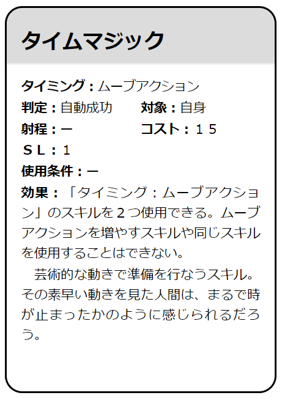

Arianrhod Skill Card Generator
====

Generate your skills like an [arianrhod](http://www.fear.co.jp/ari/) official book.

## Installation

Use [pipenv](https://pipenv-ja.readthedocs.io/ja/translate-ja/).

```
pipenv install
pipenv shell
python main.py < your_skill_text.txt > your_skill_card.html
```

## Format

You can use 'テキスト' output from [Online character sheet](https://charasheet.vampire-blood.net/).

## Sleeve use

If you want to use this program with sleeves, try `python main.py --sleeve`.

## Example

```
echo "《タイムマジック》 1/ムーブ/自動成功/自身/-/15//「タイミング：ムーブアクション」のスキルを2つ使用できる。ムーブアクションを増やすスキルや同じスキルを使用することはできない。フレーバー: 芸術的な動きで準備を行なうスキル。その素早い動きを見た人間は、まるで時が止まったかのように感じられるだろう。" | python main.py > skill.html
```



```
python main.py --sleeve --large < sample.txt > skill.html
```


